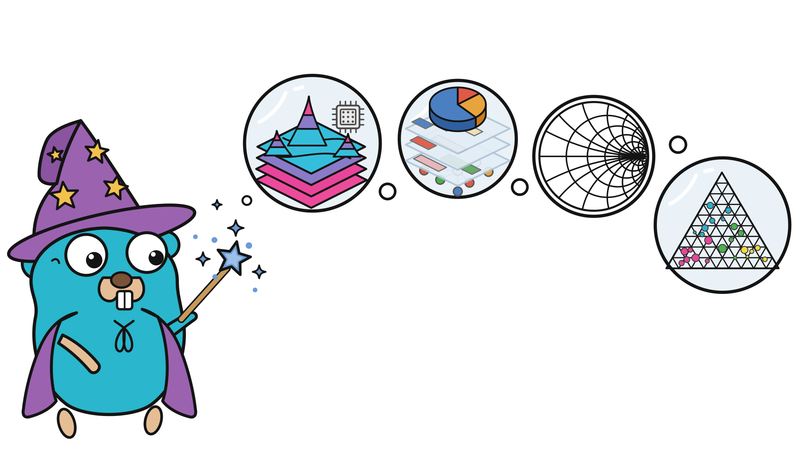

<p align="center">
  
</p>

# figure

[](https://github.com/timzifer/figure/actions/workflows/ci.yml)
[](https://github.com/timzifer/figure/actions/workflows/ci.yml)
[](https://pkg.go.dev/github.com/timzifer/figure)
[](LICENSE)

**A grammar-driven plotting library for Go: one model, many backends, runs
everywhere — built on the GoGPU stack.**

> **Status: `v0.x`.** The model is settled and the API is not frozen. Three
> seams that take positional scale arguments are being reshaped so that a chart
> can gain a dimension additively
> ([ADR 0056](docs/adr/0056-three-dimensional-charts.md),
> [ADR 0060](docs/adr/0060-parameter-structs-at-every-seam.md)); `v1.0.0`
> returns when they are done.

The name is the thesis: a figure is a chart that has been finished and placed,
and what makes it one is the model behind it rather than the file it was saved
as. One specification enters figure, a spectrum of output formats comes out.


---

## What it is

One declarative chart specification, rendered through interchangeable backends.
The core is **pure Go with no dependencies at all** — not "no cgo", literally
nothing outside the standard library — and emits both vector formats, SVG and
PDF. Add one module and the same specification renders to PNG and JPEG through
[`gogpu/gg`](https://github.com/gogpu/gg), still with `CGO_ENABLED=0`.

| | Dependencies | Output |
|---|---|---|
| `github.com/timzifer/figure` | **stdlib only** | SVG, PDF, browser canvas |
| `github.com/timzifer/figure/backend/gg` | GoGPU (`gg`), `x/image` — zero CGO | PNG, JPEG, an in-memory surface |
| `github.com/timzifer/figure/backend/window` | GoGPU (`gogpu`, `gg`) — zero CGO | a native window |
| `github.com/timzifer/figure/backend/gg/gpu` | GoGPU (`gg/gpu`, `wgpu`) — zero CGO | — (switches the GPU tier on) |
| `github.com/timzifer/figure/arrow/v18` | `apache/arrow-go` — zero CGO | — (a data source) |

The browser is in the core too, because it needs nothing to be: a canvas 2D
context is reached through `syscall/js`, which is the standard library
([ADR 0017](docs/adr/0017-browser-backend.md)). Everything else is behind the
same `ir.Backend` interface, in a module of its own, so what a program links is
what it asked for: a server that renders SVG links nothing but the standard
library, and a desktop program that opens a window links a window layer.

## Install

The release check in [CONTRIBUTING.md](CONTRIBUTING.md#releasing) verifies each
module outside the development workspace before it is tagged, so a published
`require` line names a core that exists.

```sh
go get github.com/timzifer/figure                  # core: SVG and PDF, stdlib only
go get github.com/timzifer/figure/backend/gg       # raster: PNG and JPEG
go get github.com/timzifer/figure/backend/window   # a native window
go get github.com/timzifer/figure/backend/gg/gpu   # optional: the GPU tier
go get github.com/timzifer/figure/arrow/v18        # optional: plot Arrow data
```

Go 1.25 or newer ([why](docs/adr/0005-go-version.md)).

## Quick start

```go
package main

import (
	"log"
	"math"

	"github.com/timzifer/figure"
	"github.com/timzifer/figure/geom"
	"github.com/timzifer/figure/palette"
	"github.com/timzifer/figure/scale"
	"github.com/timzifer/figure/theme"
)

func main() {
	xs := make([]float64, 200)
	ys := make([]float64, 200)
	for i := range xs {
		xs[i] = float64(i) / 20
		ys[i] = math.Sin(xs[i])
	}

	p := figure.New(
		figure.Theme(theme.Dark),
		figure.Size(800, 400),
		figure.Title("Signal"),
		figure.YTitle("amplitude"),
	)
	p.X(scale.Linear(scale.Nice()))
	p.Y(scale.Linear(scale.Nice()))
	p.Add(geom.Line(
		figure.Float64Columns(map[string][]float64{"x": xs, "y": ys}),
		geom.X("x"), geom.Y("y"),
		geom.Color(palette.Blue),
		geom.Tension(0.4),
	))

	if err := p.Render(figure.SVG("signal.svg")); err != nil {
		log.Fatal(err)
	}
}
```

For PDF or raster, swap the target — nothing else changes:

```go
err := p.Render(figure.PDF("signal.pdf"))          // still stdlib only

import ggbackend "github.com/timzifer/figure/backend/gg"
err := p.Render(ggbackend.PNG("signal.png"))
```

A runnable version is in [`examples/signal`](examples/signal).

## Gallery

Every figure in [docs/gallery.md](docs/gallery.md) is rendered by
[`backend/gg/cmd/gallery`](backend/gg/cmd/gallery) and re-checked in CI, so a
picture cannot drift away from the code that produced it.

| | |
|---|---|
|  |  |
|  |  |
|  |  |

## What it does

- **Scales** — linear, time, log, symlog, ordinal. Extended-Wilkinson tick
  placement, calendar-unit time steps, minor ticks per decade, pinned tick
  sequences.
- **Marks** — lines, points, bars, areas, steps, rects, boxplots, histograms,
  violins, ridgelines, hexbins, beeswarms, ECDFs, trends, treemaps, icicles,
  sankeys, arcs, error bars, intervals, text, annotations.
- **Coordinate systems** — Cartesian, polar (so a bar is a pie and an icicle is
  a sunburst), and Smith.
- **Colour and size** — qualitative palettes, sequential and diverging ramps,
  classed ramps, a size channel, and the legend, colourbar or size key that
  follows from which of them a layer was handed.
- **Layout** — facets, subplot grids, secondary axes, guides solved by one
  constraint solver.
- **Output** — SVG and PDF from the standard library alone; PNG, JPEG and an
  in-memory surface through one module; a browser canvas; a native window; an
  opt-in GPU tier.
- **Interaction** — hit-testing, hover and click, zoom and pan, an overlay
  layer, clickable legends, linked views, keyed transitions, streaming data.
- **Reading** — typeset notation in labels, and a description, a data table and
  per-mark semantics for a reader that is not an eye.

The long version, with what each one is for and which record decided it, is in
[docs/features.md](docs/features.md).

## Reading further

| | |
|---|---|
| [docs/gallery.md](docs/gallery.md) | Every figure the library draws, rendered from the code that draws it. |
| [docs/charts.md](docs/charts.md) | Chart forms and the programs that produce them: categories, stacks, pies and donuts, Smith charts, edge tables, boxes, distributions, bubbles, small multiples, secondary axes, label placement. |
| [docs/interaction.md](docs/interaction.md) | The browser, the native window, the GPU tier, live data, and a chart that follows its surface. |
| [docs/scale-out.md](docs/scale-out.md) | What happens when a chart has more rows than the screen has pixels. |
| [docs/reading.md](docs/reading.md) | Notation in labels, and charts that can be read without being seen. |
| [docs/spec.md](docs/spec.md) | A chart as JSON, and plotting Arrow data. |
| [docs/features.md](docs/features.md) | The full feature surface. |
| [docs/milestones.md](docs/milestones.md) | How each capability arrived, and the argument that shaped it. |

## How it fits together

```
   Your spec  ──►  Model  ──►  IR  ──►  Backend  ──►  output
   ─────────      ─────      ────      ───────       ──────
   geoms          scales     ~8        backend/svg     SVG
   scales         coords     drawing   backend/pdf     PDF
   coords         layout     ops       backend/canvas  browser canvas
   theme          ticks                backend/gg      PNG / JPEG / a surface
   facets         panels               backend/window  a native window
```

The `ir.Backend` interface is the seam. Geoms never touch a renderer; a renderer
never knows what a scale is. That is what lets figure stand on a young,
fast-moving graphics stack without being welded to it — the whole gg adapter is
about 300 lines ([why that matters](docs/adr/0006-gg-coupling-surface.md)).

Things ride on that seam without widening it. A render can be *watched*, so that
a pointer can be told which layer drew what it is over
([ADR 0015](docs/adr/0015-hit-testing.md)); two frames can be *compared*, so that
a surface repaints only what moved
([ADR 0016](docs/adr/0016-streaming-and-damage.md)); and a backend that can carry
words, resize itself, or repaint part of a frame says so through an optional
interface — `ir.Semantics`, `ir.Resizer`, `ir.Partial` — rather than through a
method every backend would have to implement. No identity channel and no damage
channel went into the drawing interface.

The native window is the same argument once more: it is a surface that draws
with the raster backend and presents the result, so there is one implementation
of every mark and a window shows what a file would
([ADR 0021](docs/adr/0021-native-window.md)).

## Documentation

- [CONCEPT.md](CONCEPT.md) — the design document: motivation, positioning,
  architecture, roadmap.
- [docs/adr](docs/adr) — why each open question was answered the way it was.
- [docs/chart-types.md](docs/chart-types.md) — every chart form, what draws it
  today, and what the missing ones would cost.
- [docs/benchmarks.md](docs/benchmarks.md) — the benchmark suite: what each
  benchmark measures, which numbers are gated, and the latest results.
- [docs/milestones.md](docs/milestones.md) — how the library was built, in the
  order it was built, with the argument behind each step.
- [pkg.go.dev](https://pkg.go.dev/github.com/timzifer/figure) — the API
  reference, generated from the doc comments.
- [CONTRIBUTING.md](CONTRIBUTING.md) — building a five-module repository, how
  to regenerate golden files and figures, and how a release is tagged.
- [SECURITY.md](SECURITY.md) — which versions get fixes, and how to report a
  vulnerability privately.
- [CODE_OF_CONDUCT.md](CODE_OF_CONDUCT.md) — what participating here looks
  like.

## A note on how this was built

Much of figure was written with an AI assistant — Claude, in Claude Code — in
the loop, under human direction and review. The design decisions and the
arguments in the ADRs are the ones a human signed off on; a good deal of the
typing was not. What makes that workable is the same thing the rest of this
README describes: every claim here is held up by a golden file, a test or a
benchmark that CI runs on every commit, so the code is checked against the
behaviour rather than against a plausible-sounding explanation of it.

## License

MIT. The core links nothing; `backend/gg` links only permissively licensed code
(gg is MIT, `x/image` is BSD-3-Clause). That is a requirement rather than a
preference — figure must be embeddable by downstream projects under any
license.
