# The gallery

Every figure the library draws, rendered from the code that draws it.

Every figure here is rendered by
[`backend/gg/cmd/gallery`](../backend/gg/cmd/gallery) and re-checked in CI, so a
picture here cannot drift away from the code that produced it.

| | |
|---|---|
|  |  |
|  |  |
|  |  |
|  |  |
|  |  |
|  |  |
|  |  |
|  |  |
|  |  |
|  |  |
|  |  |
|  |  |
|  |  |
|  |  |
|  |  |
|  |  |
|  |  |
|  |  |
|  | 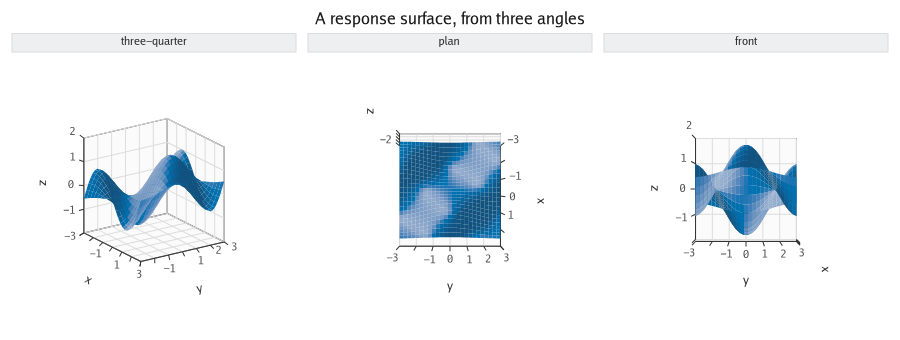 |
| 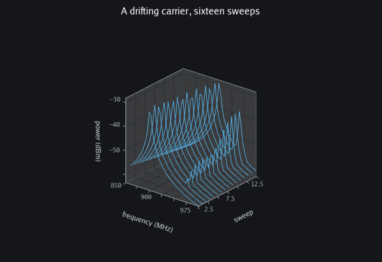 | 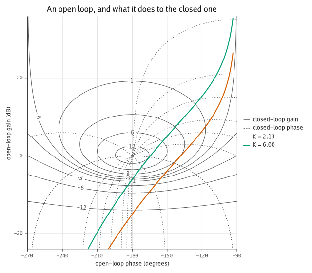 |
| 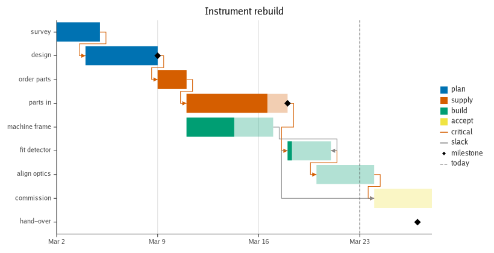 |  |
|  | 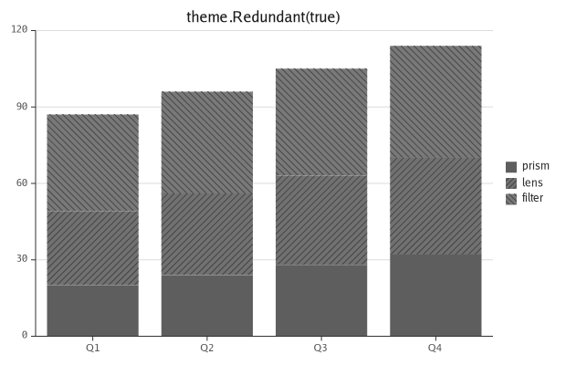 |
| 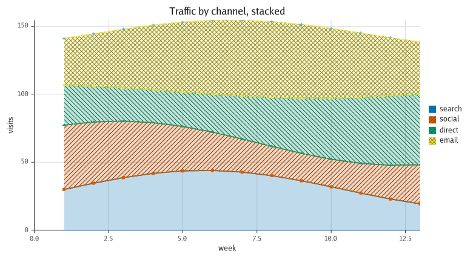 | 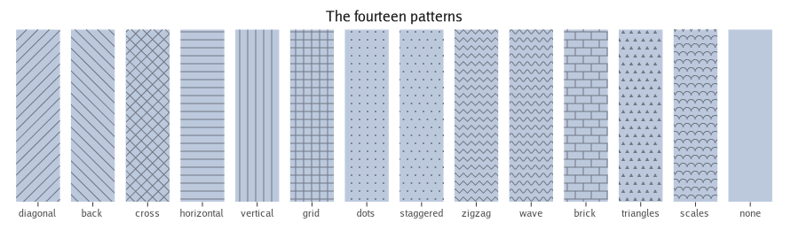 |
| 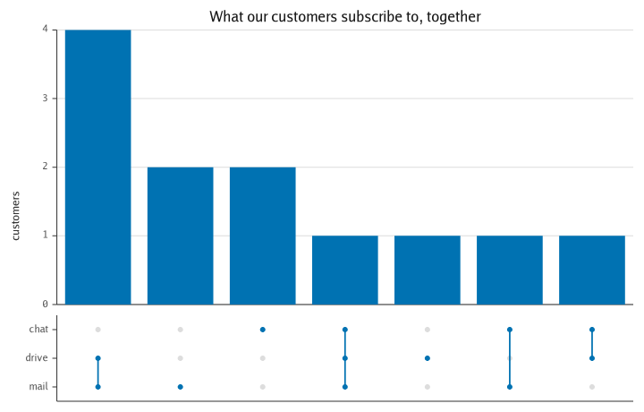 | 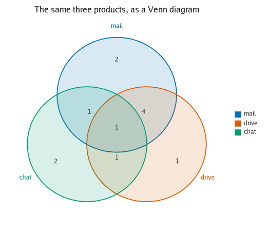 |
| 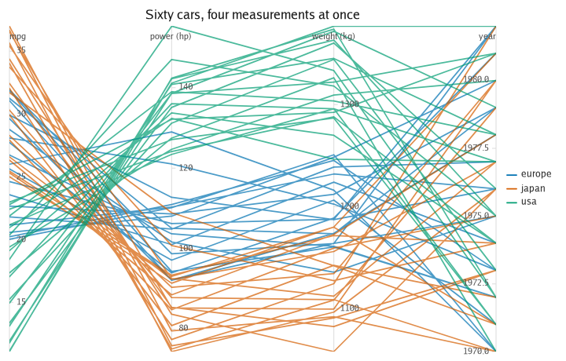 | 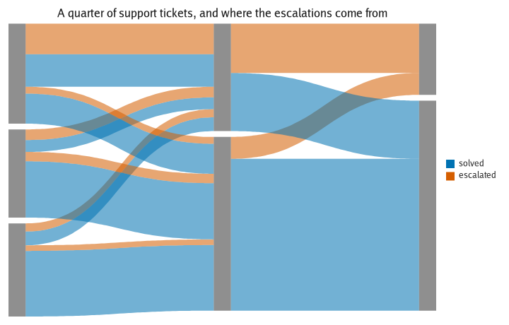 |
| 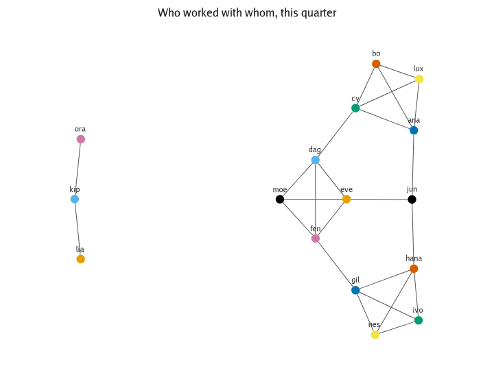 | 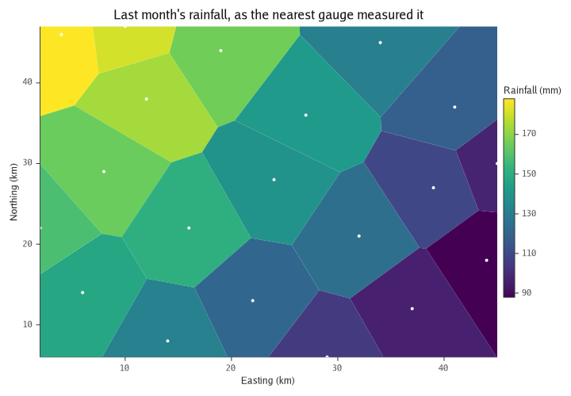 |
| 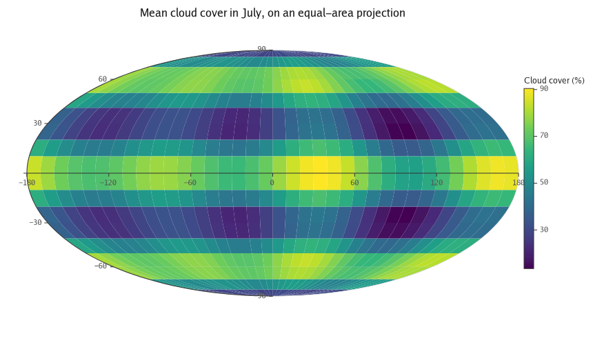 | 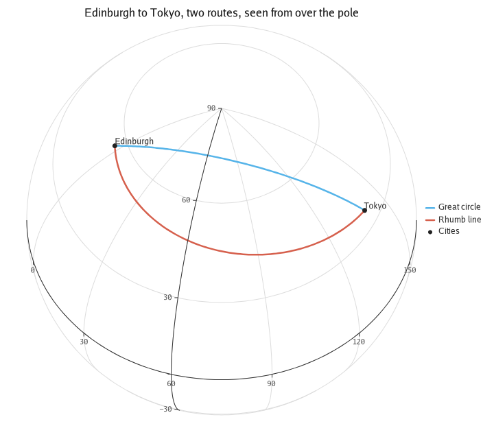 |
|  | 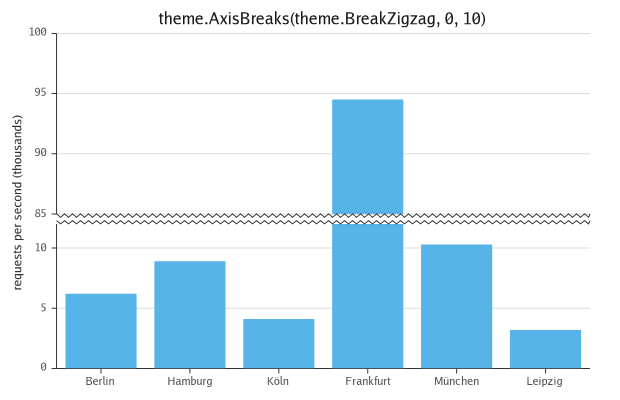 |
| 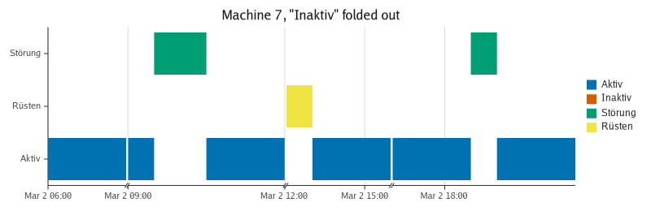 | |

---

**[README](../README.md)** · **[CONCEPT](../CONCEPT.md)** · **[ADRs](adr)** · [Chart forms](charts.md) · [Interaction](interaction.md) · [A million rows](scale-out.md) · [Reading a chart](reading.md) · [JSON and Arrow](spec.md) · [Features](features.md) · [Chart-type catalogue](chart-types.md) · [Benchmarks](benchmarks.md) · [How it was built](milestones.md)
