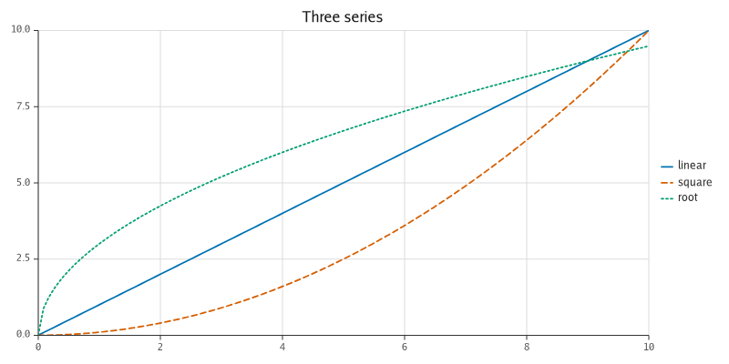
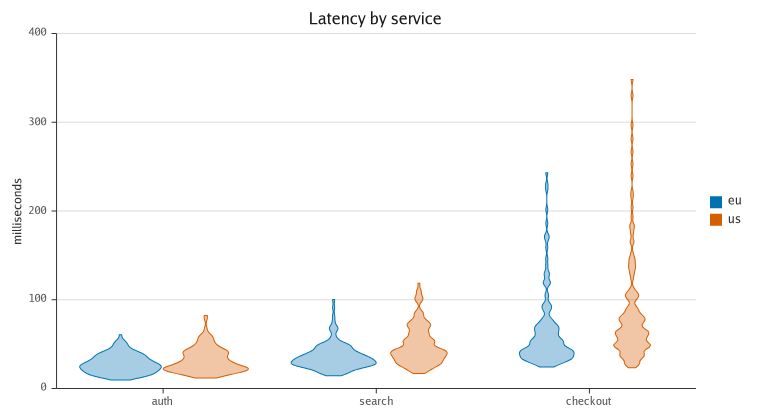
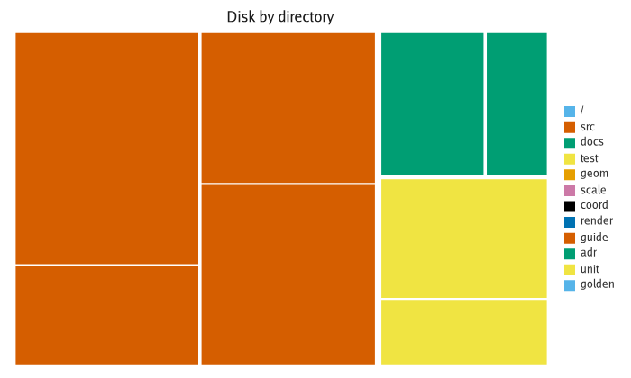
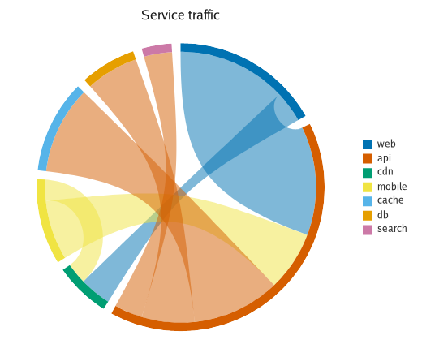
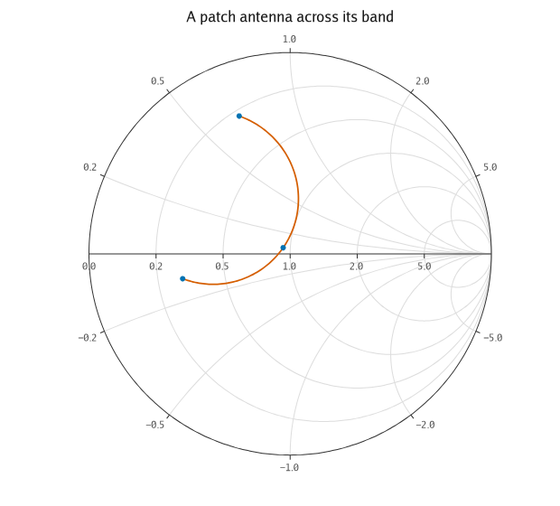
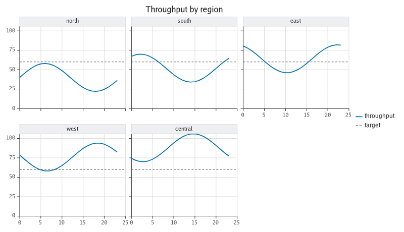
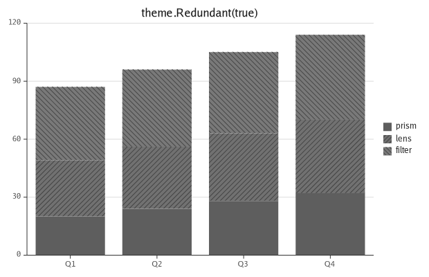

# The gallery

Every figure the library draws, rendered from the code that draws it, in
eight groups, 63 figures in all. Each picture below opens its group.

Every figure here is rendered by
[`backend/gg/cmd/gallery`](../backend/gg/cmd/gallery) and re-checked in CI, so a
picture here cannot drift away from the code that produced it.

| | |
|---|---|
|  **[Lines, points and bars](gallery/basics.md)** · 17 figures The everyday forms: series over a continuous or time axis, scatter, bars, areas and steps, with intervals, thresholds, second axes and typeset labels. |  **[Distributions](gallery/distributions.md)** · 8 figures How a sample is spread: binned, summarised, smoothed, or every observation placed. |
|  **[Parts of a whole](gallery/parts.md)** · 6 figures One total split into its shares, flat, stacked over time or nested. |  **[Flows, networks and sets](gallery/relations.md)** · 8 figures What connects to what: flows between stages, links between people, overlaps between sets and one line per record across many axes. |
|  **[Coordinates and projections](gallery/coordinates.md)** · 8 figures Charts whose frame is not a plain rectangle: polar, Smith and Nichols charts, map projections, the plane cut into cells and a 3-D scene from several cameras. |  **[Markets](gallery/markets.md)** · 4 figures What a trading screen draws: candles and OHLC bars on a calendar that folds out the closed days, indicators, volume tracks, the last price on the axis, and a live chart with a crosshair. |
|  **[Layout, axes and scale](gallery/scale.md)** · 7 figures One chart split into panels or placed on a grid, axes broken or folded, and data far larger than the pixels it lands on. |  **[Without colour](gallery/colour.md)** · 5 figures Redundant encoding: hatch patterns that carry a series when the colour cannot, in print, in greyscale or for a reader who cannot tell the hues apart. |

---

**[README](../README.md)** · **[CONCEPT](../CONCEPT.md)** · **[ADRs](adr)** · [Chart forms](charts.md) · [Interaction](interaction.md) · [A million rows](scale-out.md) · [Reading a chart](reading.md) · [JSON and Arrow](spec.md) · [Features](features.md) · [Chart-type catalogue](chart-types.md) · [Benchmarks](benchmarks.md) · [How it was built](milestones.md)
