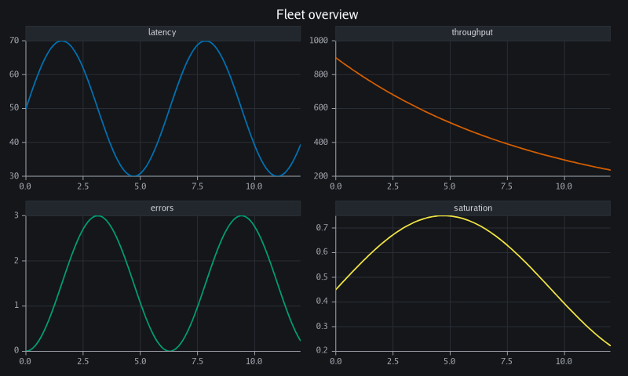
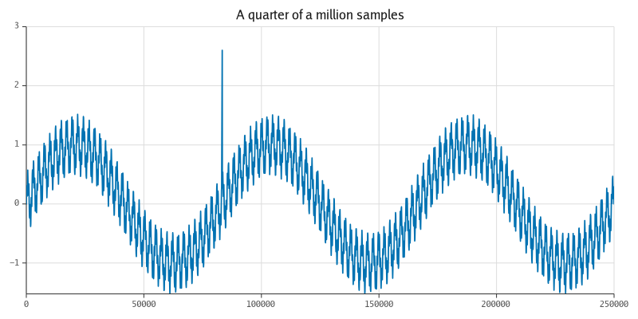
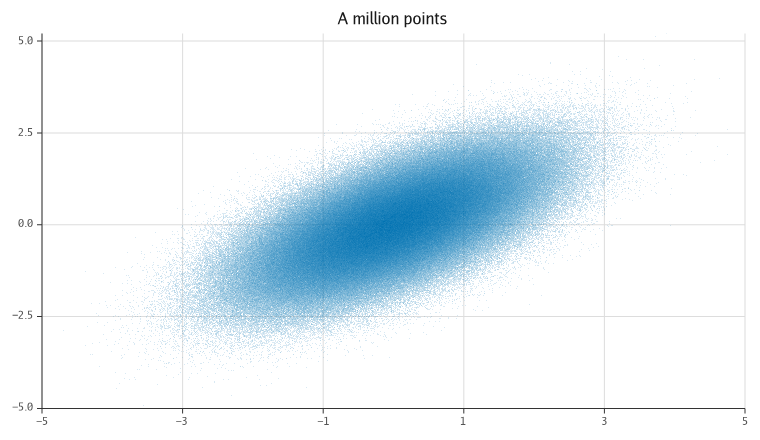
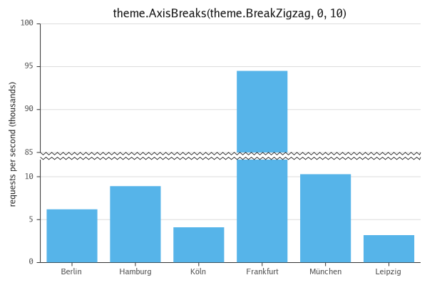
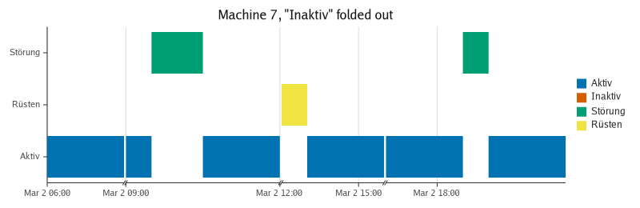

# The gallery: layout, axes and scale

One chart split into panels or placed on a grid, axes broken or folded, and data far larger than the pixels it lands on.

Every figure here is rendered by
[`backend/gg/cmd/gallery`](../../backend/gg/cmd/gallery) and re-checked in CI, so a
picture here cannot drift away from the code that produced it.

[← The gallery](../gallery.md) · [Lines, points and bars](basics.md) · [Distributions](distributions.md) · [Parts of a whole](parts.md) · [Flows, networks and sets](relations.md) · [Coordinates and projections](coordinates.md) · [Markets](markets.md) · **Layout, axes and scale** · [Without colour](colour.md)

| | |
|---|---|
|  |  |
|  |  |
|  |  |
|  |  |

---

**[README](../../README.md)** · **[CONCEPT](../../CONCEPT.md)** · **[ADRs](../adr)** · [The gallery](../gallery.md) · [Chart forms](../charts.md) · [Interaction](../interaction.md) · [A million rows](../scale-out.md) · [Reading a chart](../reading.md) · [JSON and Arrow](../spec.md) · [Features](../features.md) · [Chart-type catalogue](../chart-types.md) · [Benchmarks](../benchmarks.md) · [How it was built](../milestones.md)
